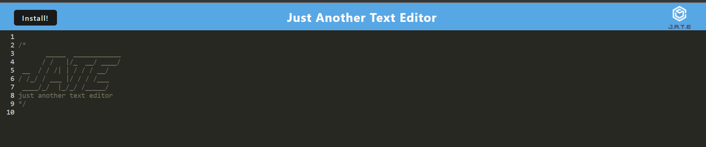
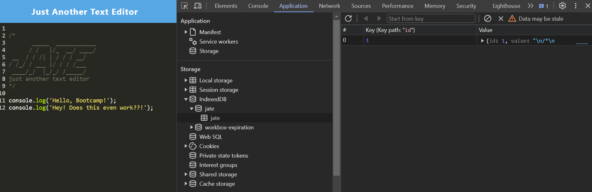
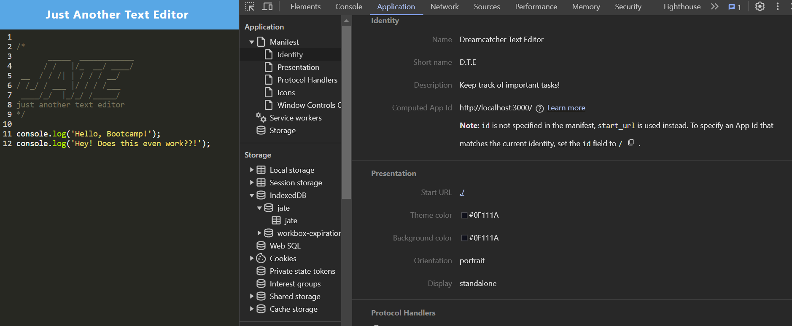
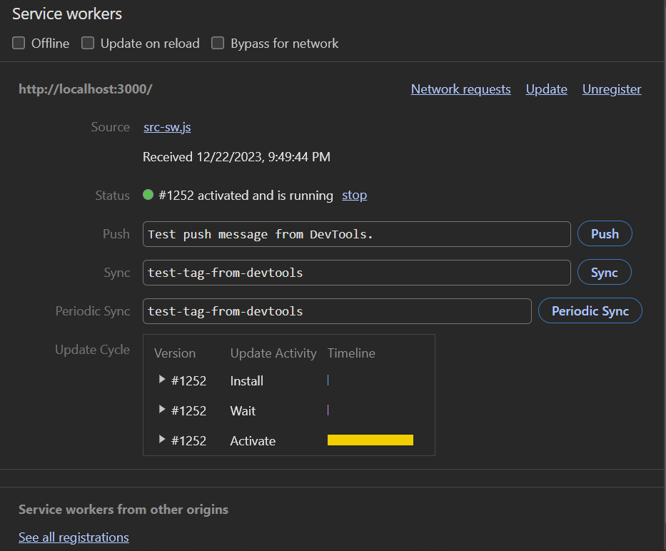
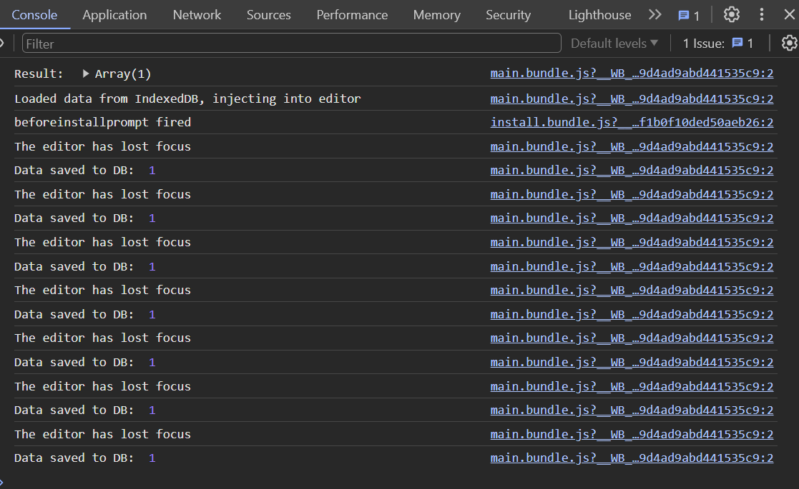

# J.A.T.E. Text Editor
<p align='center'>

</p>


## Overview

J.A.T.E. is a Progressive Web Application (PWA) that can run in your browser window, offline, and can also be installed to your local machine via a download button. This application features data persistence techniques, which ensures that the application will run regardless of browser support. This application uses a database called 'IndexedDB' and contains the 'idb package'. J.A.T.E. is deployed to Render, and can be viewed by clicking [here](https://j-a-t-e-y9ac.onrender.com/)


## Usage

### User Story
```
AS A developer
I WANT to create notes or code snippets with or without an internet connection
SO THAT I can reliably retrieve them for later use
```


### Acceptance Criteria
```
GIVEN a text editor web application
WHEN I open my application in my editor
THEN I should see a client server folder structure
WHEN I run `npm run start` from the root directory
THEN I find that my application should start up the backend and serve the client
WHEN I run the text editor application from my terminal
THEN I find that my JavaScript files have been bundled using webpack
WHEN I run my webpack plugins
THEN I find that I have a generated HTML file, service worker, and a manifest file
WHEN I use next-gen JavaScript in my application
THEN I find that the text editor still functions in the browser without errors
WHEN I open the text editor
THEN I find that IndexedDB has immediately created a database storage
WHEN I enter content and subsequently click off of the DOM window
THEN I find that the content in the text editor has been saved with IndexedDB
WHEN I reopen the text editor after closing it
THEN I find that the content in the text editor has been retrieved from our IndexedDB
WHEN I click on the Install button
THEN I download my web application as an icon on my desktop
WHEN I load my web application
THEN I should have a registered service worker using workbox
WHEN I register a service worker
THEN I should have my static assets pre cached upon loading along with subsequent pages and static assets
WHEN I deploy to Heroku
THEN I should have proper build scripts for a webpack application
```


## Installation

This application is deployed to [Render](https://j-a-t-e-y9ac.onrender.com/).

To run this application on your local machine:
 - Pull and clone this branch
 - Run `npm i` to install necessary packages
 - Start application by typing `npm start` into your console


## Demo

<p align='center'>




</p>

## License

 [MIT](https://choosealicense.com/licenses/mit/)


## Technologies Used

1. [Webpack](https://webpack.js.org/) and [Workbox](https://web.dev/learn/pwa/workbox): Webpack is a module bundler for JavaScript applications. It takes your code and its dependencies, such as stylesheets and images, and bundles them together in a way that's optimized for the web. Workbox is a set of JavaScript libraries for adding offline support to web applications. It integrates with build tools like Webpack to generate a service worker, enabling features such as caching and serving assets offline.
2. [Concurrently](https://www.npmjs.com/package/concurrently): Concurrently is a command-line tool that allows you to run multiple commands concurrently. It's often used in development environments to run multiple scripts, such as starting both a front-end and back-end server simultaneously.
3. JavaScript
4. [IndexedDB](https://developer.mozilla.org/en-US/docs/Web/API/IndexedDB_API): IndexedDB is a low-level API for storing large amounts of structured data, including files and blobs, on the client-side. It is particularly useful for web applications that need to work with substantial amounts of data offline.
5. [Express](https://expressjs.com/): Express is a web application framework for Node.js. It simplifies the process of building robust and scalable web applications by providing a set of features for routing, middleware, and handling HTTP requests and responses.
6. [NodeJS](https://nodejs.org/docs/latest/api/): Node.js is a runtime environment that allows JavaScript to be run on the server side. It is built on the V8 JavaScript runtime and enables the development of scalable network applications. Node.js includes a set of built-in modules for various tasks.
7. [Babel](https://babeljs.io/docs/): Babel is a JavaScript compiler that allows you to use the latest ECMAScript features (JavaScript syntax enhancements) without worrying about browser compatibility. It transpiles modern JavaScript code into an older version that can be executed in a wide range of environments.


## Contributing

Anyone can feel free to contribute to this project. Email me here: contact@jeremiah-haynes.com


## Authors

This project was created by [me](https://www.github.com/dsatpm)

### References & Documentation

I used a lot of references for this project. Here is a short list of some of the resources used:

 -[ChatGPT](https://chat.openai.com/) Used mainly for helping find and explain bugs
 -[Stack Overflow](https://stackoverflow.com/) Used this for helping find problems that other people had with projects like this
 -[Github](https://www.github.com) Github was fantastic for accessing documentation regarding the technologies used.
